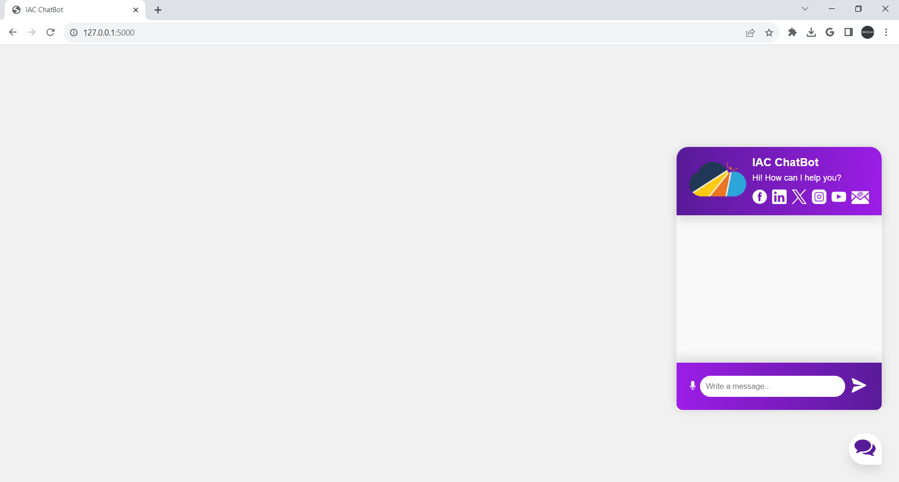

# <p align="center">✨Speech & Text Driven Generative AI Chatbot✨</p>

<div id="top"></div>

<h1> Website: <a href="https://speech-driven-generative-ai-chatbot-5ltx-main-kvu5gnz7cq-wm.a.run.app/">Visit Now🌐</a></h1>

<!-- --------------------------------------------------------------------------------------------------------------------------------------------------------- -->

<h2>Table of Contents🧾</h2>

- [AI Chatbot Overview](#ai-chatbot-overview)
- [Technology Used🚀](#technology-used)
- [Snap of Main Page⭐](#snap-of-main-page)
- [Initial Setup💥](#initial-setup)
- [Contact Me📞](#contact-me)
<br>

Welcome to the Speech & Text Driven Generative AI Chatbot project! This innovative project combines the power of speech recognition and natural language generation to create an advanced chatbot capable of engaging in dynamic conversations driven by both speech and text inputs.

<!-- --------------------------------------------------------------------------------------------------------------------------------------------------------- -->

<h2>AI Chatbot Overview📌</h2>
The goal of this project is to develop a sophisticated chatbot that can understand and respond to user inputs in both speech and text formats. Leveraging state-of-the-art technologies in speech recognition, natural language processing, and generative AI, we aim to create a seamless and immersive conversational experience. Users will be able to interact with the chatbot using their voice or by typing, opening up new possibilities for human-computer interaction.

<!-- --------------------------------------------------------------------------------------------------------------------------------------------------------- -->

<h2>Technology Used🚀</h2>

<p>
  <a href="https://www.w3schools.com/python/"> </a>
  <a href="https://www.tutorialspoint.com/flask/index.htm"> </a>
  <a href="https://www.w3schools.com/gen_ai/chatgpt-3-5/index.php"> </a>
  <a href="https://www.w3schools.com/html/"> </a>
  <a href="https://www.w3schools.com/css/"> </a>
  <a href="https://www.w3schools.com/js/"></a>
  <a href="https://www.w3schools.in/google-cloud-services"></a>
</p>
<p align="right">(<a href="#top">back to top</a>)</p>

<!-- --------------------------------------------------------------------------------------------------------------------------------------------------------- -->

<h2>Snap of Main Page⭐</h2>


<p align="right">(<a href="#top">back to top</a>)</p>

<!-- --------------------------------------------------------------------------------------------------------------------------------------------------------- -->

<h2>Initial Setup💥</h2>

- Download and install Python (Version 3.9 or above) from the website provided below.
```
https://www.python.org/downloads/
```
- Download and install Git from the website provided below.
```
https://git-scm.com/downloads
```
- Clone the GitHub Repository by typing the below command in the terminal.
```
git clone https://github.com/SnehilSharma31/Speech-and-Text-Driven-Generative-AI-Chatbot.git
```
- Change the directory where the project is being cloned by typing the below command in the terminal.
```
cd Speech-and-Text-Driven-Generative-AI-Chatbot/
```
- Install the required packages by typing the below command in the terminal.
```
pip install -r requirements.txt
```
- First run the chat.py file by typing the below command in the terminal.
```
python chat.py
```
- Then run the app.py file by typing the below command in the terminal.
```
python app.py
```
- Go to a browser and type the following local IP address (with port number).
```
http://127.0.0.1:5000
```
- Enjoy chatting with the AI Chatbot.
<p align="right">(<a href="#top">back to top</a>)</p>

<!-- --------------------------------------------------------------------------------------------------------------------------------------------------------- -->

<h2>Contact Me📞</h2>

You can contact me through LinkedIn mentioned below.<br><br>
<a href="https://www.linkedin.com/in/snehilsharma31/"></a>

<!-- --------------------------------------------------------------------------------------------------------------------------------------------------------- -->

<h3>Give it a 🌟 if you ❤ the AI Chatbot. Happy Coding👨‍💻</h3>
<p align="right">(<a href="#top">back to top</a>)</p>
